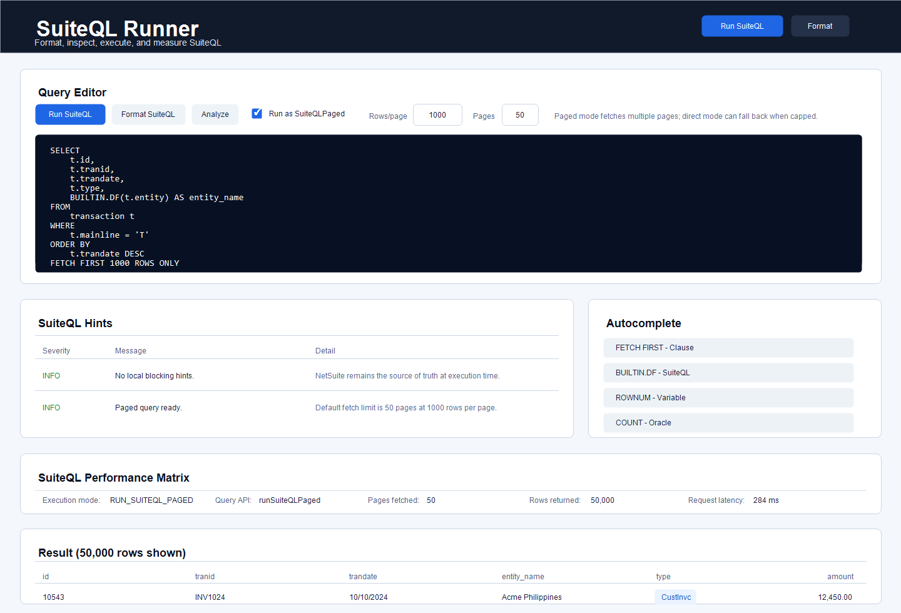

# NetSuite SuiteQL Runner

SuiteQL Runner is an SDF SuiteApp that gives administrators, developers, and analysts a NetSuite-native workspace for writing, formatting, checking, executing, measuring, and asking AI-assisted questions about SuiteQL, reports, searches, and NetSuite record schemas.

The app is built as a NetSuite Single Page Application and executes queries through a RESTlet. Local query hints are intentionally non-blocking: users can still run a query with warnings and see the exact NetSuite error in the result panel.



## Why Use This SuiteApp

- It keeps SuiteQL work inside NetSuite, using the current user's role, permissions, and account context.
- It avoids copying queries and data into external SQL tools when the work should stay in the account.
- It packages the UI, RESTlet, scripts, and deployments together through SDF for repeatable installation.
- It gives support and implementation teams a consistent query runner across sandbox, release preview, and production accounts.
- It captures performance signals such as RESTlet latency, server execution time, returned rows, page count, result count, and script usage.
- It helps users fix common SQL dialect mistakes before execution while still letting NetSuite be the final source of truth.

See [Why SuiteApp](./docs/WHY_SUITEAPP.md) for the fuller rationale.

## Features

- SuiteQL editor with Run, Format, Analyze, and AI Chat actions.
- MSSQL-style formatting with uppercase keywords and readable clause breaks.
- Static SuiteQL and Oracle SQL hinting for common errors and dialect mismatches.
- Query autocomplete for known SuiteQL and Oracle SQL clauses, keywords, functions, built-ins, pseudo-columns, and bind variables.
- Query Editor `AI Chat` toggle that opens a floating chat panel.
- AI chat uses the NetSuite `N/llm` module and specializes in reports, saved searches, standard record type IDs, SuiteQL sources, transaction type codes, standard fields, joins, and table relationships, while still allowing broader NetSuite and SuiteQL questions.
- RESTlet-based execution with `N/query.runSuiteQL` or `N/query.runSuiteQLPaged`.
- Paginated result mode with configurable rows per page and page count. The page count defaults to `50`.
- `Run as SuiteQLPaged` checkbox for paged execution, with unchecked direct `runSuiteQL` mode that automatically falls back to paged execution when the result appears capped.
- Result grid rendered immediately below the editor.
- Collapsible Result, SuiteQL Performance Matrix, SuiteQL Hints, and Autocomplete panels so users can fold sections while iterating on a query.
- Performance matrix for execution mode, API used, fallback status, client validation time, request latency, server execution time, rows, columns, pages, and governance usage.
- SDF project layout with manifest, deploy file, SPA object, RESTlet object, and File Cabinet scripts.

## Project Layout

```text
src/
  FileCabinet/
    SuiteApps/com.netsuite.suiteqlrunner/suiteqlrunner/
      SpaClient.js
      SpaServer.js
    SuiteScripts/com.netsuite.suiteqlrunner/
      SuiteQLRunnerRestlet.js
  Objects/
    custspa_suiteqlrunner.xml
    customscript_nsqlr_restlet.xml
  SuiteApps/com.netsuite.suiteqlrunner/suiteqlrunner/
    application/
    domain/
    infrastructure/
    presentation/
    SpaClient.tsx
    SpaServer.ts
    SuiteQLRunner.tsx
  deploy.xml
  manifest.xml
```

## Architecture

The SPA follows clean architecture boundaries:

- `domain` contains shared models, SuiteQL catalog data, query text helpers, and constants.
- `application` contains query analysis, formatting, autocomplete, performance matrix mapping, query-run orchestration, and record chat orchestration.
- `infrastructure` contains the NetSuite RESTlet gateway adapter for query execution and AI record chat.
- `presentation` contains passive UIF panels, floating record chat UI, and grid helpers.
- `SuiteQLRunner.tsx` is the thin container that wires state, use cases, and presentation.

The RESTlet is also organized into request normalization, validation, SuiteQL execution, record chat handling, row collection, response mapping, and telemetry helpers.

See [Architecture](./docs/ARCHITECTURE.md) for more detail.

## Setup

1. Install dependencies.

   ```bash
   npm install
   ```

2. Build the deployable SPA bundle.

   ```bash
   npm run bundle
   ```

3. Validate or deploy with SuiteCloud CLI.

   ```bash
   npm run validate
   npm run deploy
   ```

The SuiteCloud CLI is included as a local dev dependency, so `npm run validate` and `npm run deploy` use the project-local CLI.

## Configuration

Before installing in a real NetSuite account:

- Confirm `com.netsuite` and `com.netsuite.suiteqlrunner` match your publisher ID and SuiteApp ID requirements.
- Review the SPA and RESTlet audiences in `src/Objects/custspa_suiteqlrunner.xml` and `src/Objects/customscript_nsqlr_restlet.xml`.
- Restrict access to trusted roles before using in production.

See [How to Use](./docs/HOW_TO_USE.md), [Deployment](./docs/DEPLOYMENT.md), and [Operations](./docs/OPERATIONS.md).

## Scripts

```bash
npm run clean      # remove generated TypeScript and SPA bundle output
npm run build      # compile TypeScript
npm run bundle     # compile and bundle the SPA into FileCabinet output
npm run validate   # bundle and run SuiteCloud validation
npm run deploy     # bundle and deploy through SuiteCloud CLI
```

## Security

This SuiteApp executes arbitrary SuiteQL as the current NetSuite user. That is useful and powerful, but it should be treated as an administrative tool.

Recommended production controls:

- Limit access to trusted administrator, developer, or analyst roles.
- Avoid broad `allroles` RESTlet deployment access in production.
- Review query results before exporting or sharing data outside NetSuite.
- Use sandbox or release preview for query development against sensitive data models.

## Current Limits

- Static linting catches common SuiteQL, Oracle SQL, and SQL Server dialect issues, but NetSuite remains the execution authority.
- Autocomplete is intentionally focused on known SuiteQL and Oracle SQL language constructs.
- The result grid shows mapped rows returned by the RESTlet and caps paged execution by rows per page times max pages.
- Rows per page defaults to `1000`. Max pages defaults to `50` and is clamped by the RESTlet.
- SuiteCloud validation requires an authenticated SuiteCloud project setup.
